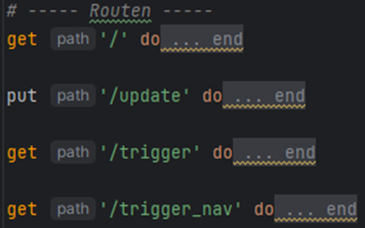
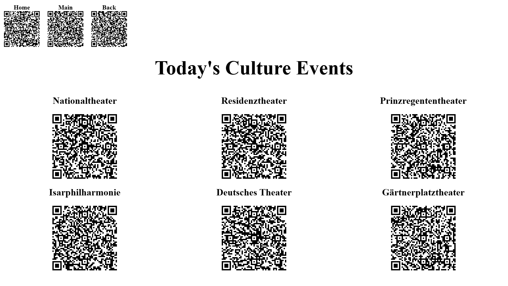
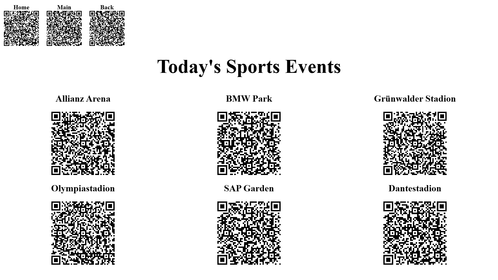
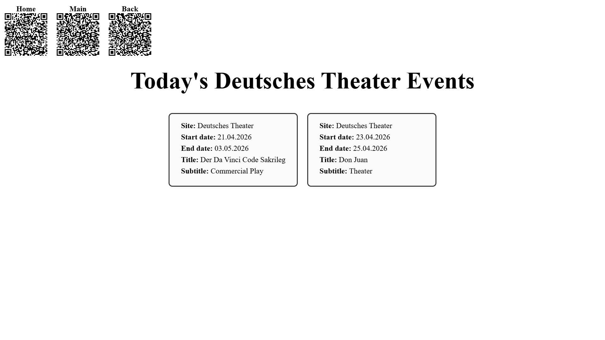
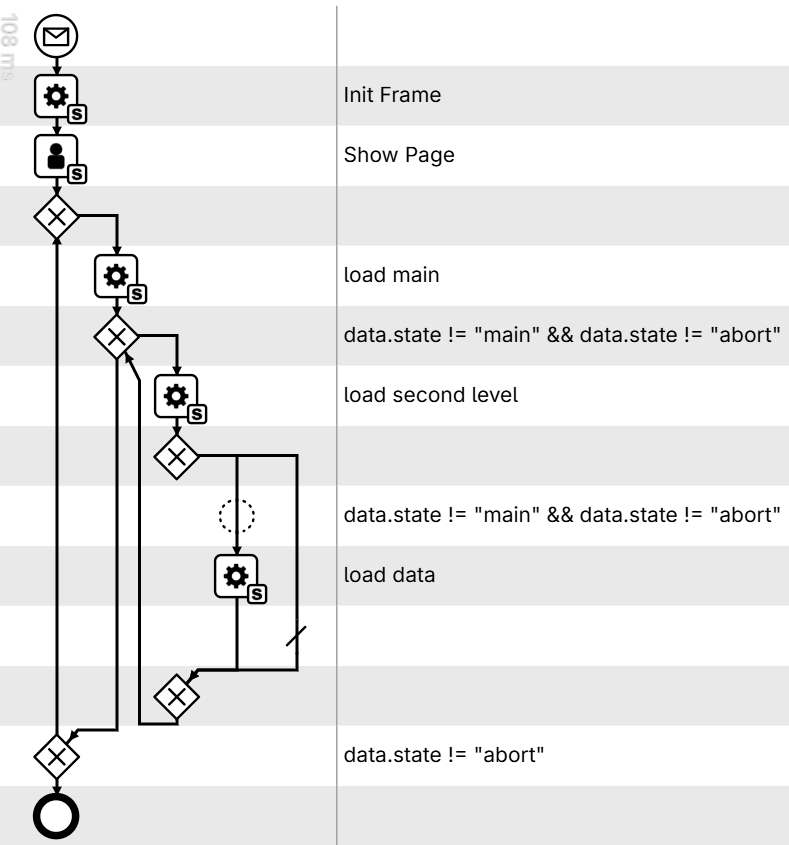
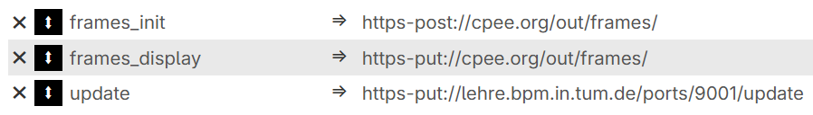

# Setup
in order to run this you have to follow these steps:
1. deploy all folders and files on the lehre server
2. run ``` Bundler install ``` to load all dependencies from the Gemfile
3. run ``` ruby misc/setup_db.rb ``` in the terminal to create the database tables
4. run ``` ruby app.rb ```
5. import the process testset into cpee.org and start the process
6. the website is hosted on https://cpee.org/out/frames/Benedikt/ (changeable in task a2 > Data Handling > Prepare)

# Project/Code Description
## Communication / Rest Endpoints (app.rb)
<br>
1. Cpee displays the / route via iframe
   - Gets the data to be displayed from the database
2. Cpee updates are sent to the /update route via put call
   - The categories hierachy is saved to the database
   - The data for the new site is crawled using the scraper.rb
   - The escalation timer and thread are started
3. /trigger is used internally for all qr codes
4. /trigger_nav is used internally for the three navigation buttons (Home, Main, Back)

Both trigger* routes send a put call to cpee using the callback id and send the corresponding site to cpee

## Escalations (escalation.rb)
When a new call to /update is received, a new escalation thread is started. 
After 120 sec, a put request to the callback address is sent with the state = „abort“
The process in cpee then finishes

## Webscraping (scraper.rb)
1. a call to /update is received and the state is a site for which data should be displayed, 
2. the events table is checked for an entry for this site and today's date
3a. if no entry is found, the corresponding url for this site is queried from the database
4. the website is then crawled for the event data which gets written to the database
3b. If an entry was found nothing further happens

## Database (datbase.rb)
There are 3 sqlite tables each with functions to read out the table and to add entries to the table
1. events:
This Table stores the actual events that were crawled and also stores all the pertinent information such as time, name of the event
2. site_urls:
This table is set up beforehand and matches each venue to the url where the events taking place at this venue can be found
3. process_event_list:
This table stores the hierachy of the categories which should be displayed. It gets filled automatically after receiving 
the information from cpee and keeps the hierachy organized by process_instance_id which is also given by cpee

## Views (views/)
There are three two types of views. Both types include the layout (layout.rb) which contains three qr codes to either abort, 
go back to main or only go up one level in the hierachy. The three qr codes included in the layout are preprocessed and 
get loaded from memory while the other qr codes are created dynamically. For the styling of the views there is an 
extensive stylesheet (public/styles.css)
1. The navigation view:
This view shows qr codes used to progress further down the hierachy
<br>



2. The data view:
This view is used to display all of todays events for a single venue<br>



## Process model (cpee.org)
The model itself looks like this:<br>


These endpoints are needed:<br>


And the following hierachy is initially implemented in the Data Objects tab but individually adaptable:<br>
{<br>
"main":["Sports","Culture"],<br>
"Sports":["Allianz Arena","BMW Park","Grünwalder Stadion","Olympiastadion","SAP Garden","Dantestadion"],<br>
"Culture":["Nationaltheater","Residenztheater","Prinzregententheater","Isarphilharmonie","Deutsches Theater","Gärtnerplatztheater"]<br>
}

